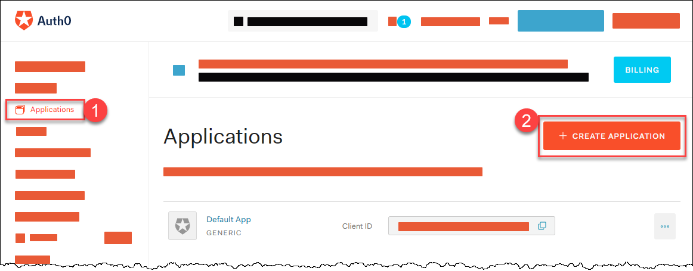
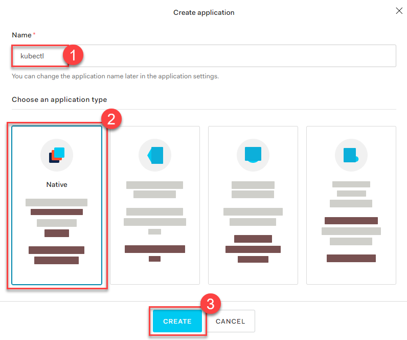
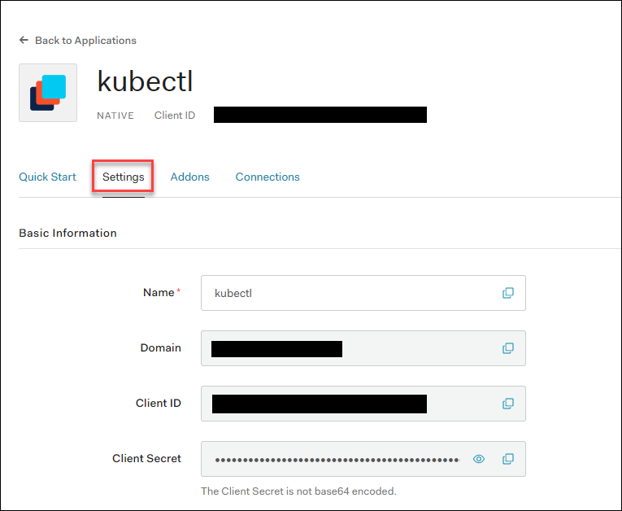
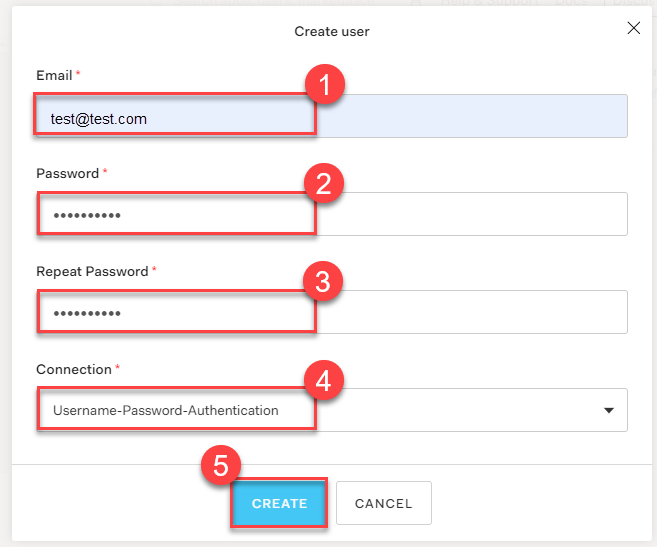
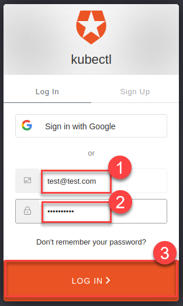

Use an identity provider to authenticate users to access shoot clusters.

## Prerequisites

Please read the following background material on [Authenticating](https://kubernetes.io/docs/reference/access-authn-authz/authentication/#openid-connect-tokens).

## Overview

Kubernetes on its own doesn’t provide any user management. In other words, users aren’t managed through Kubernetes resources. Whenever you refer to a human user it’s sufficient to use a unique ID, for example, an email address. Nevertheless, Gardener project owners can use an identity provider to authenticate user access for shoot clusters in the following way:

1. [Configure an Identity Provider](#configure-an-identity-provider) using **OpenID Connect** (OIDC).
2. [Configure a local kubectl oidc-login](#configure-a-local-kubectl-oidc-login) to enable `oidc-login`.
3. [Configure the shoot cluster](#configure-the-shoot-cluster) to share details of the OIDC-compliant identity provider with the Kubernetes API Server. 
4. [Authorize an authenticated user](#authorize-an-authenticated-user) using role-based access control (RBAC).
5. [Verify the result](#verify-the-result)

> Gardener allows administrators to modify aspects of the control plane setup. It gives administrators full control of how the control plane is parameterized. While this offers much flexibility, administrators need to ensure that they don’t configure a control plane that goes beyond the service level agreements of the responsible operators team.  

## Configure an Identity Provider

Create a tenant in an OIDC compatible Identity Provider. For simplicity, we use *Auth0*, which has a free plan.

1. In your tenant, create a client application to use authentication with `kubectl`:

   

2. Provide a *Name*, choose *Native* as application type, and choose *CREATE*.

   

3. On tab *Settings*, copy the following parameters to a local text file:

    * *Domain*

      > Corresponds to the **issuer** in OIDC. It must be an `https`-secured endpoint (Auth0 requires a trailing `/` at the end). More information: [Issuer Identifier](https://openid.net/specs/openid-connect-core-1_0.html#Terminology).
    * *Client ID*
    * *Client Secret*

      

4. Configure the client to have a callback url of `http://localhost:8000`. This callback connects to your local `kubectl oidc-login` plugin:

   

5. Save your changes.


4. Verify that `https://<Auth0 Domain>/.well-known/openid-configuration` is reachable.

5. Choose *Users & Roles* \> *Users* \> *CREATE USERS* to create a user with a user and password:

   

   > Users must have a *verified* email address.

## Configure a local `kubectl` `oidc-login`

1. Install the `kubectl` plugin [oidc-login](https://github.com/int128/kubelogin). We highly recommend the [krew](https://github.com/kubernetes-sigs/krew) install tool, which also makes other plugins easily available.

    ```console
    kubectl krew install oidc-login
    ```

    The response looks like this:

    ```console
    Updated the local copy of plugin index.
    Installing plugin: oidc-login
    CAVEATS:
    \
    |  You need to setup the OIDC provider, Kubernetes API server, role binding and kubeconfig.
    |  See https://github.com/int128/kubelogin for more.
    /
    Installed plugin: oidc-login
    ```

2. Prepare a `kubeconfig` for later use:
   
    ```console
    cp ~/.kube/config ~/.kube/config-oidc
    ``` 

3. Modify the configuration of `~/.kube/config-oidc` as follows:
   
    ```yaml
    apiVersion: v1
    kind: Config

    ...

    contexts:
    - context:
        cluster: shoot--project--mycluster
        user: my-oidc
      name: shoot--project--mycluster

    ...

    users:
    - name: my-oidc
      user:
        exec:
          apiVersion: client.authentication.k8s.io/v1beta1
          command: kubectl
          args:
          - oidc-login
          - get-token
          - --oidc-issuer-url=https://<Issuer>/ 
          - --oidc-client-id=<Client ID>
          - --oidc-client-secret=<Client Secret>
          - --oidc-extra-scope=email,offline_access,profile
    ``` 

To test our OIDC-based authentication, context `shoot--project--mycluster` of `~/.kube/config-oidc` is used in a later step. For now, continue to use the configuration `~/.kube/config` with administration rights for your cluster.

## Configure the shoot cluster

Modify the shoot cluster YAML as follows, using the client ID and the domain (as issuer) from the settings of the client application you created in Auth0:

```yaml
kind: Shoot
apiVersion: garden.sapcloud.io/v1beta1
metadata:
  name: mycluster
  namespace: garden-project
...
spec:
  kubernetes:
    kubeAPIServer:
      oidcConfig:
        clientID: <Client ID>
        issuerURL: "https://<Issuer>/"
        usernameClaim: email
```

This change of the `Shoot` manifest triggers a reconciliation. Once the reconciliation is finished, your OIDC configuration is applied. It **doesn't** invalidate other certificate-based authentication methods. Wait for Gardener to reconcile the change. It can take up to 5 minutes.


## Authorize an authenticated user

In Auth0, you created a user with a verified email address, `test@test.com` in our example. For simplicity, we authorize a single user identified by this email address with cluster role `view`:

```yaml
apiVersion: rbac.authorization.k8s.io/v1
kind: ClusterRoleBinding
metadata:
  name: viewer-test
roleRef:
  apiGroup: rbac.authorization.k8s.io
  kind: ClusterRole
  name: view
subjects:
- apiGroup: rbac.authorization.k8s.io
  kind: User
  name: test@test.com
```

As administrator, apply the cluster role binding in your shoot cluster. 

## Verify the result

1. To step into the shoes of your user, use the prepared `kubeconfig` file `~/.kube/config-oidc`, and switch to the context that uses `oidc-login`:
   
    ```
    cd ~/.kube
    export KUBECONFIG=$(pwd)/config-oidc
    kubectl config use-context `shoot--project--mycluster`
    ```

2. `kubectl` delegates the authentication to plugin `oidc-login` the first time the user uses `kubectl` to contact the API server, for example:

    ```
    kubectl get all
    ```

    The plugin opens a browser for an interactive authentication session with Auth0, and in parallel serves a local webserver for the configured callback.


3. Enter your login credentials. 

    

    You should get a successful response from the API server:

    ```
    Opening in existing browser session.
    NAME                 TYPE        CLUSTER-IP   EXTERNAL-IP   PORT(S)   AGE
    service/kubernetes   ClusterIP   100.64.0.1   <none>        443/TCP   86m
    ``` 

    > After a successful login, `kubectl` uses a token for authentication so that you don’t have to provide user and password for every new `kubectl` command. How long the token is valid can be configured. If you want to log in again earlier, reset plugin `oidc-login`:
    > 1. Delete directory `~/.kube/cache/oidc-login`.
    > 1. Delete the browser cache.
    >

4. To see if your user uses cluster role `view`, do some checks with `kubectl auth can-i`.

    * The response for the following commands should be `no`:
   
        ```
        kubectl auth can-i create clusterrolebindings
        ```
        ```
        kubectl auth can-i get secrets
        ```
        ```
        kubectl auth can-i describe secrets
        ```
    
    * The response for the following commands should be `yes`:

        ```
        kubectl auth can-i list pods
        ```
        ```
        kubectl auth can-i get pods
        ```
 
If the last step is successful, you’ve configured your cluster to authenticate against an identity provider using OIDC.

## Related Links

[Auth0 Pricing](https://auth0.com/pricing/)

